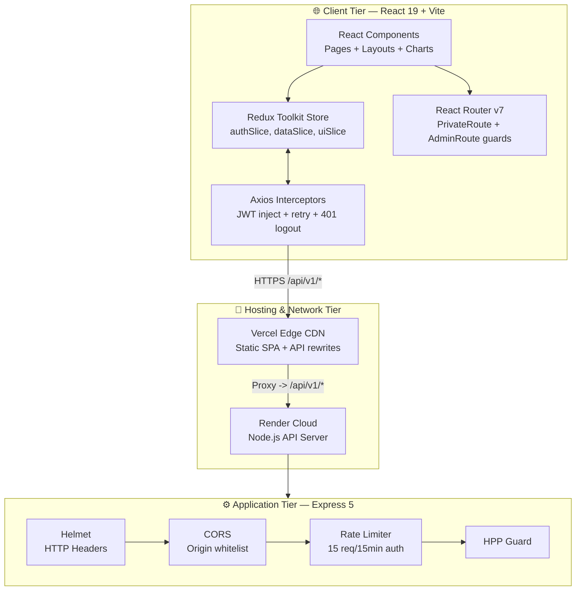
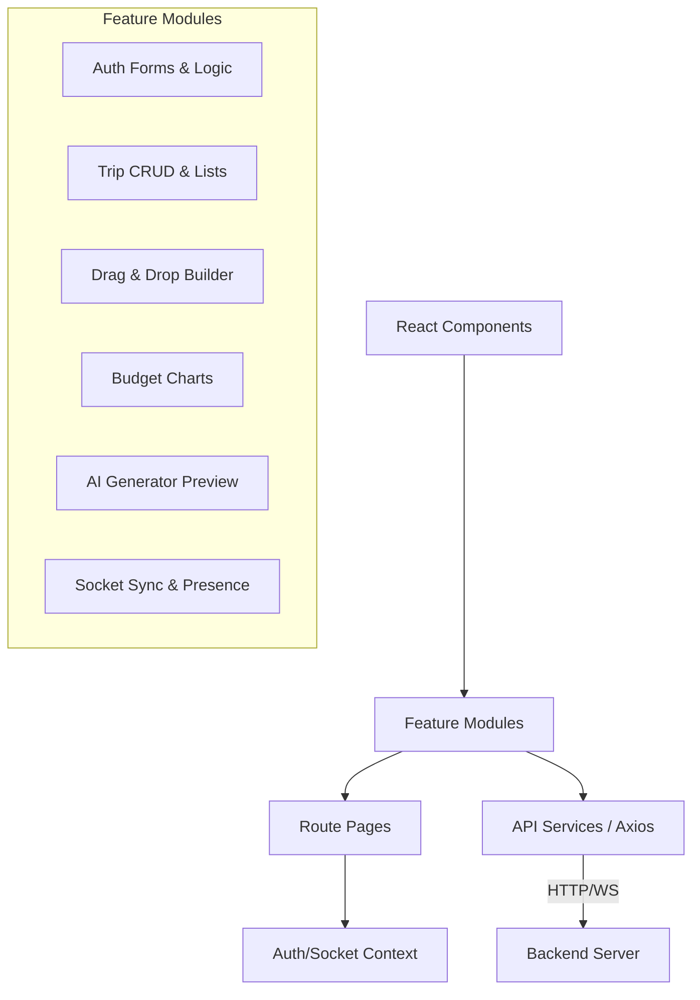
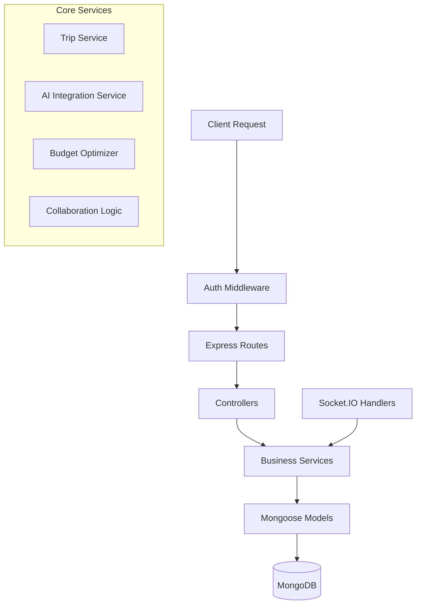

# 🌍 GlobeTrotter


**GlobeTrotter** is a full-stack, personalized multi-city travel planning platform built on the MERN stack. It allows users to construct complete trips composed of multiple city stops, each with dated activities, budgets, and schedules. 

The platform combines manual itinerary building with AI-assisted itinerary generation and budget optimization, real-time multi-user collaboration, and public trip sharing/cloning.

---

## 🚀 Key Features

- **Multi-City Itineraries:** Build a complete trip with multiple city stops and daily activities.
- **AI Smart Itinerary Generator:** Turn a natural-language prompt into a structured, editable draft itinerary.
- **Smart Budget Optimizer:** Get quantified savings recommendations when your trip goes over budget.
- **Real-Time Collaboration:** Co-edit trips simultaneously with friends via Socket.IO, with live attribution of changes.
- **Public Trip Sharing & Cloning:** Publish itineraries publicly and let other users clone them.
- **Drag-and-Drop Sequencing:** Easily reorder cities and activities to perfectly time your trip.

---

## 🔄 End-to-End Travel Planning Workflow

The **end-to-end Planning Workflow** maps how a user progresses from authentication through trip creation, itinerary scheduling, budget optimization, and final trip sharing — the complete 8-stage journey:

```mermaid
graph LR
    S1[<b>Stage 1<br>User Authentication</b><hr/>Register / Login<br>JWT issued<br>Session Initiated]
    S2[<b>Stage 2<br>Dashboard Entry</b><hr/>Dashboard load<br>Trip summaries render<br>Budget highlight]
    S3[<b>Stage 3<br>Trip Initialization</b><hr/>Create trip shell<br>Set dates & budget<br>Add cover image]
    S4[<b>Stage 4<br>Itinerary Generation</b><hr/>Manual city search OR<br>AI text prompt generation<br>Draft preview]
    S5[<b>Stage 5<br>Activity Scheduling</b><hr/>Drag & drop reorder<br>Timeline updates<br>Socket.IO broadcast]
    S6[<b>Stage 6<br>Budget Analysis</b><hr/>Cost roll-up by category<br>Recharts visualization<br>Over-budget detection]
    S7[<b>Stage 7<br>AI Optimization</b><hr/>Smart budget suggestions<br>LLM alternative ideas<br>One-click cost reduction]
    S8[<b>Stage 8<br>Collaboration & Share</b><hr/>Invite friends to co-edit<br>Real-time sync<br>Public clone link]

    S1 --> S2 --> S3 --> S4 --> S5 --> S6 --> S7 --> S8
    
    style S1 fill:#1e3a8a,stroke:#3b82f6,stroke-width:2px,color:#fff
    style S2 fill:#064e3b,stroke:#10b981,stroke-width:2px,color:#fff
    style S3 fill:#4c1d95,stroke:#8b5cf6,stroke-width:2px,color:#fff
    style S4 fill:#78350f,stroke:#f59e0b,stroke-width:2px,color:#fff
    style S5 fill:#14532d,stroke:#22c55e,stroke-width:2px,color:#fff
    style S6 fill:#0c4a6e,stroke:#0ea5e9,stroke-width:2px,color:#fff
    style S7 fill:#831843,stroke:#e11d48,stroke-width:2px,color:#fff
    style S8 fill:#312e81,stroke:#6366f1,stroke-width:2px,color:#fff
```



---

## 🏗️ Tech Stack & Architecture Flow



## 🔁 Complete End-to-End Request Lifecycle

The diagram below maps the exact lifecycle of a typical API call (e.g., adding a trip activity) — from user interaction through the React UI, CDN proxy, Express security pipeline, MongoDB, and back to the browser:

```mermaid
sequenceDiagram
    autonumber
    actor User as User Browser
    participant React as React + Redux
    participant Axios as Axios Client
    participant CDN as Vercel CDN
    participant API as Express API
    participant DB as MongoDB

    User->>React: Click 'Add Activity' (Name, Date)
    React->>Axios: dispatch(addActivityThunk(payload))
    Note over Axios: Inject Authorization: Bearer <JWT>
    Axios->>CDN: HTTPS POST /api/v1/trips/:id/activities
    CDN->>API: Proxy -> Render cloud server
    
    rect rgb(30, 41, 59)
        Note right of API: Security Pipeline (5 layers)
        API->>API: 1. Helmet -- set secure HTTP headers
        API->>API: 2. CORS -- validate origin whitelist
        API->>API: 3. Rate Limiter -- check request limits
        API->>API: 4. JWT verify -- decode + inject req.user
        API->>API: 5. Validator -- sanitize payload
    end
    
    API->>DB: TripActivity.create(payload)
    Note over DB: Execute DB Write
    DB-->>API: Return new document
    
    API-->>CDN: 201 Created { success: true, data }
    CDN-->>Axios: Forward JSON response
    Axios-->>React: Resolve AsyncThunk -> fulfilled
    React-->>User: Update Redux state (UI renders activity)
```



## 📈 Data Analytics Pipeline (MongoDB Aggregation)

When an admin requests platform-wide metrics (e.g., popular destinations and average costs), the system runs a highly optimized **7-stage MongoDB Aggregation Pipeline** for maximum performance:


## 🔒 Security Architecture

The platform implements a **Zero-Trust, Defense-in-Depth** security model across both client and server tiers:

```mermaid
graph TD
    subgraph ClientSide [🌐 Client-Side Security]
        direction LR
        Yup[Yup Schema Validation<br/>Client-side form guards]
        Route[Route Guards<br/>PrivateRoute / AdminRoute]
        LocalJWT[JWT Storage<br/>Auto-inject via Axios interceptor]
        AutoLog[Auto Logout<br/>401 response -> clear token + redirect]
        Backoff[Exponential Backoff<br/>5xx retry: 1s -> 2s -> fail]
        
        Yup --> Route --> LocalJWT
        LocalJWT --> AutoLog
        LocalJWT --> Backoff
        
        style Yup fill:#1e40af,stroke:#3b82f6,color:#fff
        style Route fill:#1e40af,stroke:#3b82f6,color:#fff
        style LocalJWT fill:#1e40af,stroke:#3b82f6,color:#fff
        style AutoLog fill:#1e40af,stroke:#3b82f6,color:#fff
        style Backoff fill:#1e40af,stroke:#3b82f6,color:#fff
    end

    subgraph APISide [⚙️ API-Side Security]
        direction TB
        Helmet[Helmet<br/>XSS, CSP, HSTS headers]
        CORS[CORS Whitelist<br/>Only allowed origins]
        Rate[Rate Limiting<br/>Auth: 15 req/15m, Data: 100 req/15m]
        HPP[HPP<br/>No duplicate query params]
        NoSQL[NoSQL Sanitizer<br/>Strip $ and . keys]
        JWT[JWT Verify<br/>RS256 signature check]
        RBAC[RBAC<br/>role: user | admin]
        
        Helmet --> CORS --> Rate --> HPP --> NoSQL --> JWT --> RBAC

        style Helmet fill:#581c87,stroke:#a855f7,color:#fff
        style CORS fill:#581c87,stroke:#a855f7,color:#fff
        style Rate fill:#581c87,stroke:#a855f7,color:#fff
        style HPP fill:#581c87,stroke:#a855f7,color:#fff
        style NoSQL fill:#581c87,stroke:#a855f7,color:#fff
        style JWT fill:#581c87,stroke:#a855f7,color:#fff
        style RBAC fill:#581c87,stroke:#a855f7,color:#fff
    end
```

## 💻 Frontend Workflow & Architecture

The frontend is built using React.js and follows a feature-based folder structure to maintain separation of concerns.



## ⚙️ Backend Workflow & Architecture

The backend is built with Node.js and Express, following a service-oriented layered architecture.



---

## 🛠️ Tech Stack

**Frontend:**
- React.js (Responsive Web)
- Tailwind CSS
- Socket.IO-client
- Axios
- Recharts (for budget visualization)
- React DnD (for drag-and-drop)

**Backend:**
- Node.js & Express.js
- MongoDB & Mongoose
- Socket.IO (Real-time collaboration)
- JWT (Authentication)
- Bcrypt (Password Hashing)

**External Services:**
- LLM API (for AI Itinerary & Budget generation)
- Cloudinary (for Image storage)

---

## 🏁 Quick Start (Development)

1. **Clone the repository:**
   ```bash
   git clone <repo-url>
   cd globetrotter
   ```

2. **Install dependencies:**
   ```bash
   # Install backend dependencies
   cd server
   npm install

   # Install frontend dependencies
   cd ../src
   npm install
   ```

3. **Set up Environment Variables:**
   - Create a `.env` file in the `/server` directory and add required keys (MongoDB URI, JWT Secret, LLM API Key, Cloudinary Config).

4. **Run the Application:**
   ```bash
   # Start backend (from /server)
   npm run dev

   # Start frontend (from /src)
   npm start
   ```

---
*Based on the GlobeTrotter Product Requirements Document.*